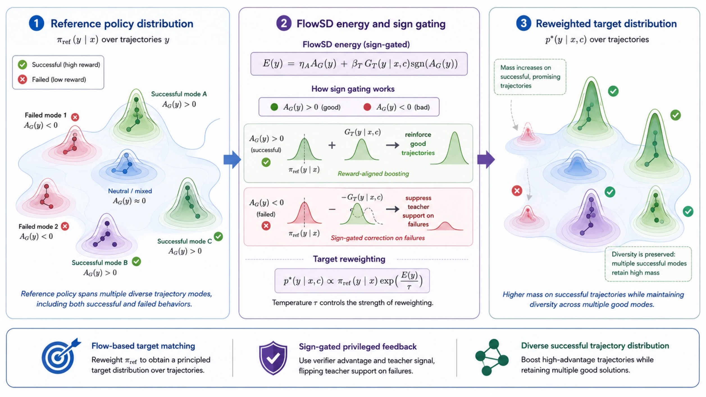
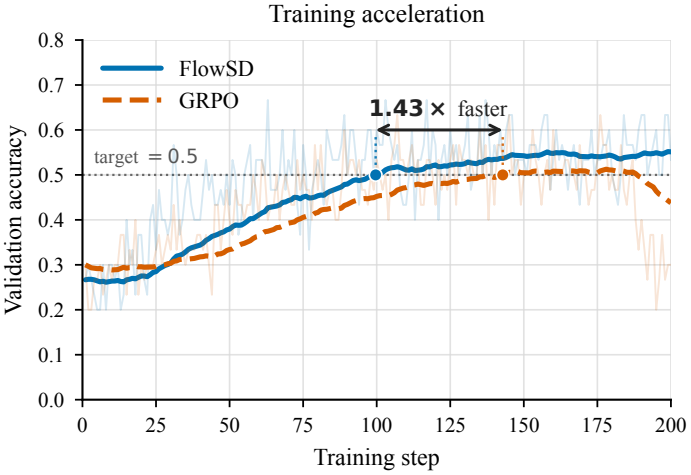
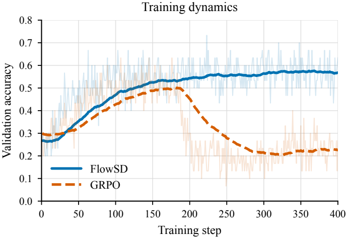
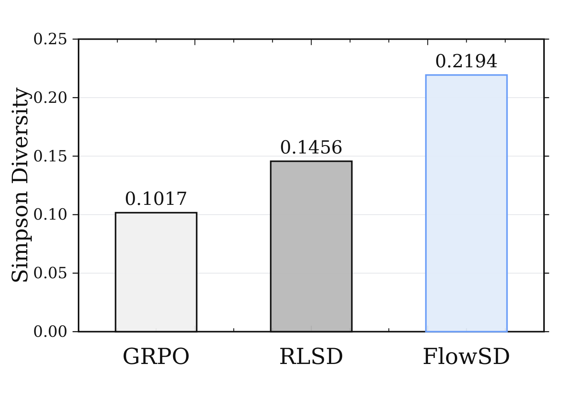

<div align="center">

# FlowSD: Trajectory-Balanced On-Policy Self-Distillation

**Learn a distribution over correct reasoning trajectories—not just one correct answer.**

[Method](#how-flowsd-works) · [Results](#main-results) · [Diversity](#more-than-accuracy-strategy-diversity) · [Quick Start](#quick-start) · [Evaluation](#evaluation) · [Citation](#citation)

</div>

---

## The message

> **For long-horizon reasoning, the distribution over correct answers matters as much as correctness itself.**

Many reasoning problems admit multiple valid solution strategies. Outcome-only reinforcement learning can discover one successful mode and then concentrate most of the policy mass on it. Local self-distillation provides denser feedback, but token imitation and local policy shaping still do not specify the normalized distribution that the student should represent over complete responses.

**FlowSD fills this gap.** It combines verifier outcomes, privileged teacher feedback, and reference-policy support into an explicit target distribution over complete reasoning trajectories, then fits that target with profiled trajectory balance.

### Why this matters

- **Accuracy:** FlowSD achieves the best five-benchmark average on both Qwen3-4B and Qwen3-8B.
- **Sampling performance:** On Qwen3-8B, FlowSD reaches **89.33% AIME24 Pass@16**.
- **Efficiency:** FlowSD reaches 0.5 AIME24 validation accuracy in about **100 steps**, versus roughly 143 for GRPO—about **1.43× faster**.
- **Stability:** FlowSD remains close to its peak over approximately 400 steps, while GRPO degrades after roughly step 180.
- **Diversity:** FlowSD more than doubles GRPO's correct-only semantic strategy diversity on AIME24.

<table>
<tr>
<td align="center"><b>Qwen3-4B average</b><br><h3>64.26</h3><sub>+1.95 over GRPO</sub></td>
<td align="center"><b>Qwen3-8B average</b><br><h3>67.61</h3><sub>+2.12 over GRPO</sub></td>
<td align="center"><b>Strategy diversity</b><br><h3>0.2194</h3><sub>2.16× GRPO</sub></td>
</tr>
</table>

---

## The central idea

Standard RLVR answers:

> Which sampled responses should receive more probability?

FlowSD asks the stronger question:

> **What normalized distribution should the policy represent over all sampled reasoning trajectories?**

FlowSD assigns four distinct roles:

| Component | Role |
|---|---|
| **Verifier advantage** | Anchors the target to task success or failure |
| **Privileged teacher gain** | Supplies dense information along an already sampled trajectory |
| **Reference policy** | Preserves support from the pretrained reasoning distribution |
| **Trajectory balance** | Converts local signals into normalized relative probabilities over complete responses |

The result is not merely another teacher-imitation loss. It is a **probability-conserving reasoning equilibrium**: verified, teacher-supported trajectories gain mass; verifier-rejected trajectories are suppressed through sign gating; and multiple successful solution modes can coexist.

<p align="center">
  
</p>
<p align="center"><sub><b>FlowSD for language-model reasoning.</b> Verifier-calibrated privileged feedback reweights the reference response distribution toward multiple successful reasoning modes.</sub></p>

---

## How FlowSD works

For each prompt $x$, the rollout policy samples an on-policy group

```math
\mathcal{G}(x)=\{y^{(1)},\ldots,y^{(N)}\},
\qquad y^{(i)}\sim\pi_{\mathrm{old}}(\cdot\mid x).
```

Here $\pi_{\mathrm{old}}$ is the rollout policy—the frozen behavior snapshot used to generate the current batch. A verifier supplies token-level scores and GRPO advantages. With the default `reward_type=grpo_advantage`, FlowSD reduces each response to the mean response advantage

```math
A(y)=\frac{1}{T}\sum_{t=1}^{T} A_t.
```

All target-side quantities below are computed without gradients.

### 1. Score the same trajectory with and without privileged context

During training, the teacher may see privileged context $c$, such as another successful response from the same rollout group. The student never sees $c$. Both teacher passes score the **same sampled response** $y$; the teacher does not generate a replacement answer.

For a response of length $T$, define the length-normalized sequence log-probability

```math
\ell_{\pi}(y\mid x,c)
=
\frac{1}{T^{\rho}}
\sum_{t=1}^{T}
\log \pi(y_t\mid y_{<t},x,c).
```

The privileged gain is computed token by token before length normalization:

```math
\begin{aligned}
G_{\mathrm{raw}}(y;x,c)
&=
\frac{1}{T^{\rho}}
\sum_{t=1}^{T}
\operatorname{clip}\!\Bigl(
\log \pi_T(y_t\mid y_{<t},x,c) \\
&\qquad
-\log \pi_{\mathrm{ref}}(y_t\mid y_{<t},x),
-B,B
\Bigr).
\end{aligned}
```

The default configuration uses $B=4$ and $\rho=1$. If no usable privileged context is available, the sample is excluded from the default FlowSD target when $\beta_T>0$.

### 2. Gate the teacher gain with verifier evidence

Teacher preference alone is not treated as evidence of correctness. FlowSD reverses the teacher contribution for negative-advantage trajectories and removes it when the advantage is zero:

```math
G(y;x,c)
=
G_{\mathrm{raw}}(y;x,c)\,\operatorname{sign}(A(y)).
```

Thus, positive verifier advantage preserves the teacher direction, negative advantage reverses it, and zero advantage disables the privileged term.

### 3. Construct the detached target score

The implementation combines reference support, signed teacher gain, and verifier signal into a length-normalized target log-score

```math
\log \widetilde{F}(y;x,c)
=
\ell_{\mathrm{ref}}(y\mid x)
+\beta_T G(y;x,c)
+\eta_A R(y).
```

By default, $R(y)=A(y)$, $\beta_T=1$, and $\eta_A=15$. The alternative `reward_type=raw_score` uses the summed verifier score instead. This is the target-side score used by the profiled trajectory-balance regression. Because the implementation length-normalizes sequence log-probabilities, $\log\widetilde{F}$ should be read as a training score rather than as an exact unnormalized log-probability when $\rho>0$.

### 4. Profile the group normalization and fit the student

Responses can share a normalization estimate only when they have the same problem and the same privileged context. For each valid group $g$, FlowSD profiles an additive baseline using the rollout policy:

```math
b_g
=
\frac{1}{|V_g|}
\sum_{j\in V_g}
\Bigl[
\ell_{\mathrm{old}}(y^{(j)}\mid x)
-\log \widetilde{F}(y^{(j)};x,c)
\Bigr].
```

where $V_g$ is the set of valid responses in that group. The detached regression target for response $i$ is

```math
t_i
=
\log\widetilde{F}(y^{(i)};x,c)+b_g.
```

The current student minimizes the squared trajectory-balance residual

```math
\mathcal{L}_{\mathrm{FlowSD}}
=
\frac{1}{\sum_i m_i}
\sum_i
m_i
\Bigl[
\ell_{\theta}(y^{(i)}\mid x)-t_i
\Bigr]^2.
```

where $m_i$ masks samples without a valid target. The default loss is unweighted; optional clipped importance weights can be enabled in the configuration. Gradients pass only through $\ell_{\theta}$—not through rewards, advantages, teacher/reference scores, the profiled baseline, or the target.

---

## Main results

All main-table entries are step-180 results reported as mean ± sample standard deviation over five random seeds. AIME24 uses Pass@16; HMMT25, Minerva, MATH500, and OlympiadBench use Pass@1. The average is the unweighted mean of the five benchmark means.

### Qwen3-4B

| Method | AIME24@16 | HMMT25 | Minerva | MATH500 | OlympiadBench | **Avg.** |
|---|---:|---:|---:|---:|---:|---:|
| GRPO | 78.00 ± 1.83 | 26.67 ± 2.36 | **51.18 ± 1.36** | 92.04 ± 0.98 | 63.68 ± 0.58 | 62.31 |
| RLSD | 73.33 ± 2.36 | 21.33 ± 3.80 | 50.29 ± 0.88 | 91.44 ± 0.52 | 61.36 ± 0.66 | 59.55 |
| **FlowSD** | **80.00 ± 0.00** | **32.00 ± 2.98** | 50.51 ± 0.56 | **93.28 ± 0.59** | **65.49 ± 0.92** | **64.26** |

**Takeaway:** FlowSD improves the five-benchmark average by **+1.95 points over GRPO** and **+4.71 over RLSD**, while leading four of the five reported benchmarks.

### Qwen3-8B

| Method | AIME24@16 | HMMT25 | Minerva | MATH500 | OlympiadBench | **Avg.** |
|---|---:|---:|---:|---:|---:|---:|
| GRPO | 85.33 ± 1.83 | 31.33 ± 7.67 | 52.87 ± 1.02 | 93.16 ± 0.83 | 64.78 ± 0.62 | 65.49 |
| RLSD | 82.67 ± 3.65 | 28.00 ± 1.83 | 52.94 ± 1.38 | 93.44 ± 0.17 | 63.56 ± 1.19 | 64.12 |
| **FlowSD** | **89.33 ± 1.49** | **34.67 ± 9.89** | **53.68 ± 0.78** | **93.52 ± 0.30** | **66.85 ± 0.46** | **67.61** |

**Takeaway:** FlowSD obtains the best mean on **every reported benchmark**, improving the aggregate by **+2.12 points over GRPO** and **+3.49 over RLSD**.

### Where the gains are strongest

| Result | FlowSD | Best baseline | Gain |
|---|---:|---:|---:|
| Qwen3-4B average | **64.26** | 62.31 GRPO | **+1.95** |
| Qwen3-8B average | **67.61** | 65.49 GRPO | **+2.12** |
| Qwen3-8B AIME24@16 | **89.33** | 85.33 GRPO | **+4.00** |
| Qwen3-8B OlympiadBench | **66.85** | 64.78 GRPO | **+2.07** |
| Qwen3-4B HMMT25 | **32.00** | 26.67 GRPO | **+5.33** |

These results support the distributional view: the largest gain appears on sampling-heavy AIME24 Pass@16, while improvements on Pass@1 benchmarks show that FlowSD does not trade broad single-sample accuracy for sampling performance.

---

## Faster and more stable optimization

The paper reports two optimization advantages on Qwen3-8B under matched rollout and evaluation budgets:

| Property | FlowSD | GRPO |
|---|---:|---:|
| Steps to AIME24 validation accuracy 0.5 | **~100** | ~143 |
| Relative speed | **1.43× faster** | 1.00× |
| Late-training behavior | Remains near peak through ~400 steps | Degrades sharply after ~180 steps |

FlowSD's normalized trajectory target provides a stable destination for probability mass, rather than repeatedly applying local reward pressure without specifying where the final response distribution should settle.

<table>
<tr>
<td width="50%" align="center">

<br><sub><b>Training acceleration.</b> FlowSD reaches the target validation accuracy about 1.43× faster than GRPO.</sub>
</td>
<td width="50%" align="center">

<br><sub><b>Training stability.</b> FlowSD remains near peak performance while GRPO degrades after roughly step 180.</sub>
</td>
</tr>
</table>

---

## More than accuracy: strategy diversity

A reasoning model can produce many correct samples that are merely surface-level rewrites of one dominant strategy. The paper therefore evaluates **semantic strategy diversity**, not lexical diversity.

The two-stage LLM-judge protocol:

1. extracts the mathematical representation, tools, theorems, and strategy signature from each complete response;
2. clusters anonymized strategy summaries within each problem and method.

Correct-only Simpson diversity is

```math
D_{\mathrm{Simpson}}=1-\sum_k p_k^2.
```

which is the probability that two sampled correct trajectories use different semantic strategies.

| Method | Correct-only Simpson diversity | Relative to GRPO |
|---|---:|---:|
| GRPO | 0.1017 | 1.00× |
| RLSD | 0.1456 | 1.43× |
| **FlowSD** | **0.2194** | **2.16×** |

<p align="center">
  
</p>

**FlowSD more than doubles GRPO's judged strategy diversity** in the AIME24 step-180, seed-0 diagnostic. This is the intended behavior of distributional self-distillation: allocate probability to multiple successful reasoning modes instead of collapsing onto the first dominant template.

---

## Ablations: both signals matter

The default Qwen3-8B configuration uses $\eta_A=15$ and $\beta_T=1$.

### Verifier coefficient $\eta_A$

| `FLOWSD_ETA_R` | Five-benchmark avg. |
|---:|---:|
| 5 | 65.65 |
| 10 | 65.41 |
| **15** | **67.61** |

### Teacher coefficient $\beta_T$

| `FLOWSD_BETA_Q` | Five-benchmark avg. |
|---:|---:|
| **1** | **67.61** |
| 2 | 66.48 |
| 3 | 65.95 |

The sweeps show that stronger shaping is not automatically better. The verifier and privileged-teacher terms must be balanced so that the target rewards correctness without over-concentrating around teacher-favored trajectories.

---

## Canonical implementation

All public interfaces consistently use FlowSD/`flowsd`:

| Interface | Canonical name |
|---|---|
| Python package | `recipe.flowsd` |
| Main module | `recipe.flowsd.main_flowsd` |
| Config class | `FlowSDConfig` |
| Hydra block | `actor_rollout_ref.actor.flowsd` |
| Loss mode | `flowsd` |
| Environment variables | `FLOWSD_*` |
| Metric prefix | `flowsd/` |
| Launcher | `recipe/flowsd/run_math_flowsd.sh` |

### Repository layout

```text
FlowSD/
├── assets/              # README and paper figures
├── recipe/
│   ├── flowsd/          # Canonical FlowSD implementation
│   ├── grpo/            # GRPO baseline
│   ├── rlsd/            # RLSD baseline
│   ├── opsd/            # Forward-KL OPSD baseline
│   ├── sdpo/            # Shared privileged-distillation utilities
│   └── antisd/          # Anti-self-distillation baseline
├── core/                # Shared trainers, workers, datasets, and rewards
├── evaluation/math/     # Math inference, grading, and aggregation
├── evaluation/code/     # Code evaluation utilities
├── analysis/diversity/  # Semantic strategy-diversity analysis
├── launch/              # Multi-node launcher
├── scripts/             # Environment and release checks
├── verl/                # Vendored verl training framework
└── runtime_env.yaml
```

---

## Installation

The large-scale experiments use PyTorch, Ray, FSDP, vLLM, and the vendored `verl` stack.

```bash
pip install -e ./verl
python3 scripts/check_environment.py
```

See [ENVIRONMENT.md](ENVIRONMENT.md) for runtime details.

### Data and model paths

```bash
export DATA_ROOT=/path/to/data
export MODEL_ROOT=/path/to/models
export OUTPUT_ROOT=/path/to/output
export TRAIN_FILE="$DATA_ROOT/rl/train_dapo17k.parquet"
export TEST_FILE="$DATA_ROOT/rl/aime24_30_boxed.parquet"
export MODEL_PATH="$MODEL_ROOT/Qwen3-8B"
```

The math recipe expects prompt-style Parquet data and verifier-compatible ground-truth answers.

---

## Quick start

### One-step smoke test

Run on an existing Ray cluster:

```bash
STEP180_VAL_ENABLE=0 \
TOTAL_TRAINING_STEPS=1 \
TEST_FREQ=1 \
SAVE_FREQ=100000 \
NNODES=4 \
N_GPUS_PER_NODE=8 \
FLOWSD_BETA_Q=1 \
FLOWSD_ETA_R=15 \
bash recipe/flowsd/run_math_flowsd.sh
```

### Step-180 paper-style run

```bash
PROJECT_NAME=verl-flowsd \
EXP_NAME=FlowSD-Qwen3-8B-math-step180 \
MODEL_PATH=/path/to/Qwen3-8B \
TRAIN_FILE=/path/to/train_dapo17k.parquet \
TEST_FILE=/path/to/aime24_30_boxed.parquet \
OUTPUT_ROOT=/path/to/output \
NNODES=4 \
N_GPUS_PER_NODE=8 \
SP_SIZE=8 \
TRAIN_PROMPT_BSZ=256 \
N_RESP_PER_PROMPT=8 \
PPO_MINI_BATCH_SIZE=128 \
MAX_PROMPT_LENGTH=2048 \
MAX_RESPONSE_LENGTH=8192 \
MAX_MODEL_LEN=10240 \
MAX_REPROMPT_LEN=10240 \
TOTAL_TRAINING_STEPS=180 \
SAVE_FREQ=10 \
FLOWSD_BETA_Q=1 \
FLOWSD_ETA_R=15 \
FLOWSD_CLIP_B=4 \
FLOWSD_RHO=1 \
LR=1e-6 \
STEP180_VAL_ENABLE=1 \
bash recipe/flowsd/run_math_flowsd.sh
```

For platform-managed jobs:

```bash
TRAIN_RECIPE_SUBDIR=flowsd \
RUN_SCRIPT=run_math_flowsd.sh \
bash launch/start.sh
```

---

## Evaluation

The step-180 evaluator supports five seeds, seven n=1 math benchmarks, and n=16 evaluation on AIME24/25/26.

```bash
RUN_DIR=/path/to/experiment \
EXPERIMENT_NAME=FlowSD-Qwen3-8B-math-step180 \
VAL_STEP=180 \
VAL_SEEDS="0 1 2 3 4" \
VAL_KEEP_MERGED_MODEL=1 \
bash recipe/flowsd/submit_step180_val.sh
```

Expected aggregate outputs:

```text
results_mean_std.md
summary_all_seeds.csv
pass1_n1_mean_std_percent.csv
aime_pass16_n16_mean_std_percent.csv
aime_sample_pass1_n16_mean_std_percent.csv
.complete
```

### Run the paper ablations

```bash
# Verifier coefficient
ETA_SWEEP_VALUES="5 10 15" \
bash recipe/flowsd/run_math_flowsd_eta_sweep.sh

# Teacher coefficient
bash recipe/flowsd/run_math_flowsd_betaT_resume_sweep.sh
```

---

## Reproducibility

A strict reproduction should record:

- paper and code versions;
- container image;
- model and dataset hashes;
- rollout group size and response-length cap;
- verifier implementation;
- `FLOWSD_ETA_R`, `FLOWSD_BETA_Q`, `FLOWSD_CLIP_B`, and `FLOWSD_RHO`;
- reference and teacher refresh semantics;
- checkpoint step and evaluation protocol.

Historical checkpoint paths may retain immutable experiment labels. The maintained source code and public interfaces use only FlowSD/`flowsd`.

---

## Citation

```bibtex
@article{huang2026flowsd,
  title   = {FlowSD: Trajectory-Balanced On-Policy Self-Distillation},
  author  = {Zixun Huang and Kishan Panaganti and Haitao Mi and Leowei Liang},
  year    = {2026}
}
```
