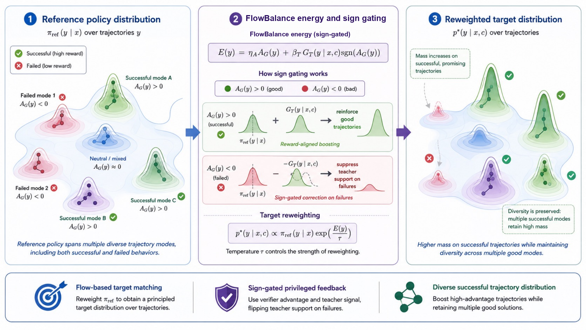
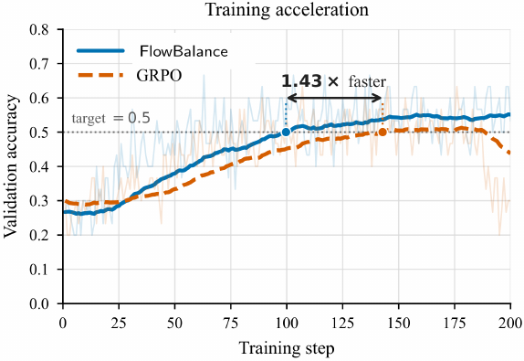
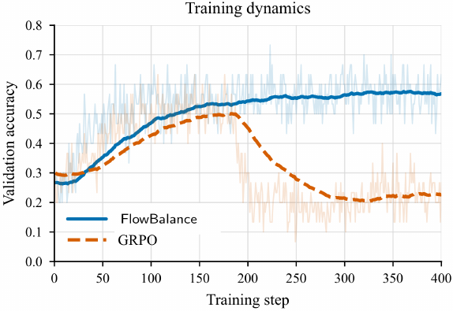
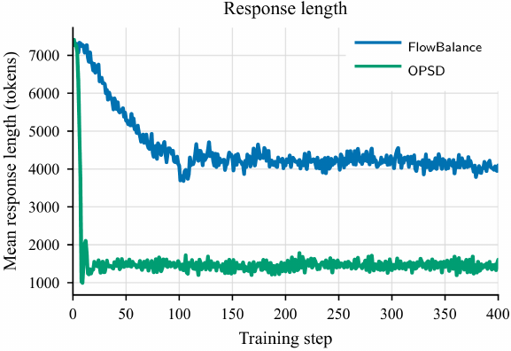
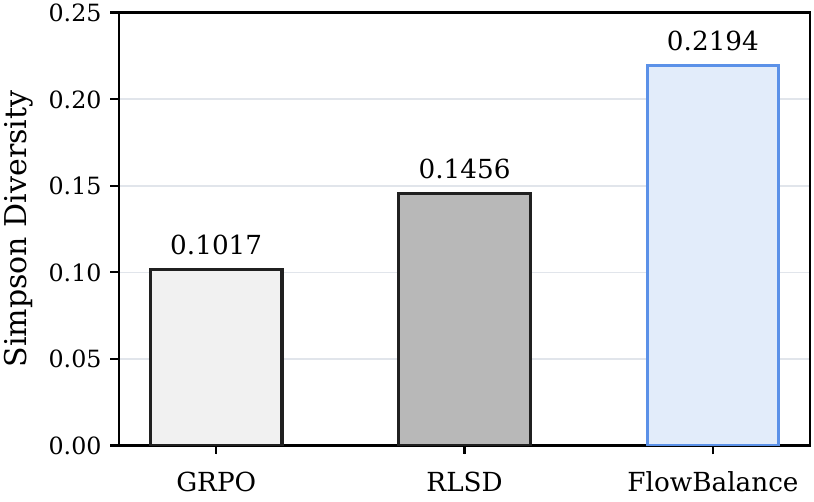

<div align="center">

# FlowBalance: A Dense-Supervision-Motivated Trajectory Balance Method for LLM Reasoning

[](#citation) [](https://github.com/alexhuang13/FlowBalance) [](https://alexhuang13.github.io/FlowBalance-Blog/)

**Learn a distribution over correct reasoning trajectories—not just one correct answer.**

[💡 Method](#method) · [📊 Results](#main-results) · [📈 Dynamics](#training-dynamics) · [🌈 Diversity](#strategy-diversity) · [🚀 Quick Start](#quick-start) · [📝 Citation](#citation)

</div>

---

## Overview

Long-horizon reasoning needs two kinds of supervision:

- **Reliable outcome supervision.** Reinforcement learning with verifiable rewards (RLVR) provides trustworthy correctness signals, but only at the end of a long response.
- **Informative trajectory supervision.** Privileged on-policy self-distillation provides dense token-level guidance, but direct imitation can favor teacher preferences that conflict with the verified outcome, shorten reasoning, or suppress exploration.

**FlowBalance** unifies these signals by defining the complete-response distribution that the policy should learn. For each on-policy response, it combines a verifier-derived group advantage with token-level log-probability gains from a privileged self-teacher. The teacher contribution is **sign-gated by the verifier advantage**, so dense feedback refines the verifier's direction rather than overriding it.

The resulting trajectory energy exponentially reweights a reference policy into a normalized target distribution. FlowBalance learns this target through **profiled trajectory balance**, using one stopped log-partition estimate per rollout group.

<p align="center">
  
</p>
<p align="center"><sub><b>FlowBalance distribution reweighting.</b> Verifier advantages and sign-gated privileged-teacher gains move probability toward successful reasoning modes while preserving reference-supported diversity.</sub></p>

### Highlights

- **Best aggregate accuracy:** FlowBalance achieves the best five-benchmark average on both Qwen3-4B and Qwen3-8B.
- **Improves FlowRL with dense supervision:** +1.04 average points on Qwen3-4B and +1.76 on Qwen3-8B.
- **Strong sampling performance:** 89.33% AIME24 Pass@16 with Qwen3-8B.
- **Faster optimization:** reaches 0.5 AIME24 validation accuracy in about 100 steps, versus roughly 143 for GRPO.
- **Stable long training:** remains near peak performance over 400 steps while GRPO degrades after approximately step 180.
- **Avoids direct-OPSD length collapse:** maintains substantially longer reasoning trajectories.
- **Greater strategy diversity:** correct-only Simpson diversity of 0.2194, versus 0.1017 for GRPO and 0.1456 for RLSD in the controlled AIME24 diagnostic.

---

## Method

For a prompt, the current policy samples a rollout group

```math
\mathcal G=(y^{(1)},\ldots,y^{(N)}).
```

The verifier produces a stopped group-relative advantage $A_i=A_{\mathcal G}(y^{(i)})$. A frozen privileged self-teacher conditions on training-only context $c$—for example, a reference solution or task feedback—and rescores the sampled tokens. Relative to the reference policy, these token scores are clipped and averaged into a dense trajectory gain $G_T$.

FlowBalance defines the composite trajectory energy

```math
E_{\mathrm{FlowBalance},\mathcal G}(y^{(i)}\mid x,c)
=
\eta_A A_i
+
\beta_T G_T(y^{(i)}\mid x,c)\,\mathrm{sign}(A_i).
```

The sign gate gives the verifier control over direction:

- teacher support **reinforces** positive-advantage responses;
- teacher pressure is **reversed** for negative-advantage responses;
- the teacher term is **disabled** when the rollout group gives no outcome preference.

Conditioned on the rollout group, the energy defines a reference-supported Gibbs target:

```math
p^*_{\mathrm{FlowBalance},\mathcal G}(y\mid x,c)
\propto
\pi_{\mathrm{ref}}(y\mid x)
\exp\!\left(\frac{E_{\mathrm{FlowBalance},\mathcal G}(y\mid x,c)}{\tau}\right).
```

The policy fits this distribution using the trajectory-balance residual

```math
\Delta_{\mathrm{TB}}
=
\tau\log Z_{\mathrm{FlowBalance},\mathcal G}(x,c)
+
\tau\log\frac{\pi_\theta(y\mid x)}{\pi_{\mathrm{ref}}(y\mid x)}
-
E_{\mathrm{FlowBalance},\mathcal G}(y\mid x,c).
```

One log-partition estimate is profiled from each rollout group, and gradients are stopped through the target-side quantities. Each component therefore has a distinct role:

| <sub>Component</sub> | <sub>Role</sub> |
|---|---|
| <sub><strong>Verifier advantage</strong></sub> | <sub>Determines outcome-aligned direction</sub> |
| <sub><strong>Privileged self-teacher</strong></sub> | <sub>Supplies dense evidence along sampled trajectories</sub> |
| <sub><strong>Sign gate</strong></sub> | <sub>Prevents teacher confidence from overriding verified outcomes</sub> |
| <sub><strong>Reference policy</strong></sub> | <sub>Controls support and policy drift</sub> |
| <sub><strong>Trajectory balance</strong></sub> | <sub>Converts the composite energy into normalized relative probabilities over complete responses</sub> |

Dense supervision is therefore realized as **distributional trajectory shaping**, not as a separate token-imitation loss.

---

## Main results

All entries are step-180 results reported as mean ± sample standard deviation over five seeds. AIME24 uses Pass@16; HMMT25, Minerva, MATH500, and OlympiadBench use Pass@1. “Avg.” is the unweighted mean of the five benchmark means.

### Qwen3-4B

| <sub>Method</sub> | <sub>AIME24@16</sub> | <sub>HMMT25</sub> | <sub>Minerva</sub> | <sub>MATH500</sub> | <sub>OlympiadBench</sub> | <sub><strong>Avg.</strong></sub> |
|---|---:|---:|---:|---:|---:|---:|
| <sub>GRPO</sub> | <sub>78.00 ± 1.83</sub> | <sub>26.67 ± 2.36</sub> | <sub>51.18 ± 1.36</sub> | <sub>92.04 ± 0.98</sub> | <sub>63.68 ± 0.58</sub> | <sub>62.31</sub> |
| <sub>OPSD</sub> | <sub>65.33 ± 3.80</sub> | <sub>14.67 ± 2.98</sub> | <sub>47.28 ± 0.56</sub> | <sub>87.56 ± 1.34</sub> | <sub>55.76 ± 1.47</sub> | <sub>54.12</sub> |
| <sub>RLSD</sub> | <sub>73.33 ± 2.36</sub> | <sub>21.33 ± 3.80</sub> | <sub>50.29 ± 0.88</sub> | <sub>91.44 ± 0.52</sub> | <sub>61.36 ± 0.66</sub> | <sub>59.55</sub> |
| <sub>FlowRL</sub> | <sub>75.33 ± 1.83</sub> | <sub>30.67 ± 4.94</sub> | <sub><strong>51.99 ± 1.51</strong></sub> | <sub>92.84 ± 0.62</sub> | <sub>65.25 ± 0.49</sub> | <sub>63.22</sub> |
| <sub><strong>FlowBalance</strong></sub> | <sub><strong>80.00 ± 0.00</strong></sub> | <sub><strong>32.00 ± 2.98</strong></sub> | <sub>50.51 ± 0.56</sub> | <sub><strong>93.28 ± 0.59</strong></sub> | <sub><strong>65.49 ± 0.92</strong></sub> | <sub><strong>64.26</strong></sub> |

FlowBalance improves the aggregate by **+1.95 over GRPO**, **+10.14 over OPSD**, **+4.71 over RLSD**, and **+1.04 over FlowRL**. It leads four of the five benchmarks; FlowRL leads Minerva.

### Qwen3-8B

| <sub>Method</sub> | <sub>AIME24@16</sub> | <sub>HMMT25</sub> | <sub>Minerva</sub> | <sub>MATH500</sub> | <sub>OlympiadBench</sub> | <sub><strong>Avg.</strong></sub> |
|---|---:|---:|---:|---:|---:|---:|
| <sub>GRPO</sub> | <sub>85.33 ± 1.83</sub> | <sub>31.33 ± 7.67</sub> | <sub>52.87 ± 1.02</sub> | <sub>93.16 ± 0.83</sub> | <sub>64.78 ± 0.62</sub> | <sub>65.49</sub> |
| <sub>OPSD</sub> | <sub>48.67 ± 3.80</sub> | <sub>4.00 ± 3.65</sub> | <sub>38.46 ± 3.85</sub> | <sub>74.56 ± 4.81</sub> | <sub>40.09 ± 3.57</sub> | <sub>41.16</sub> |
| <sub>RLSD</sub> | <sub>82.67 ± 3.65</sub> | <sub>28.00 ± 1.83</sub> | <sub>52.94 ± 1.38</sub> | <sub>93.44 ± 0.17</sub> | <sub>63.56 ± 1.19</sub> | <sub>64.12</sub> |
| <sub>FlowRL</sub> | <sub>86.67 ± 0.00</sub> | <sub>30.67 ± 4.35</sub> | <sub>52.79 ± 1.37</sub> | <sub>92.92 ± 0.50</sub> | <sub>66.20 ± 1.05</sub> | <sub>65.85</sub> |
| <sub><strong>FlowBalance</strong></sub> | <sub><strong>89.33 ± 1.49</strong></sub> | <sub><strong>34.67 ± 9.89</strong></sub> | <sub><strong>53.68 ± 0.78</strong></sub> | <sub><strong>93.52 ± 0.30</strong></sub> | <sub><strong>66.85 ± 0.46</strong></sub> | <sub><strong>67.61</strong></sub> |

FlowBalance obtains the best mean on **every reported benchmark**, improving the aggregate by **+2.12 over GRPO**, **+26.45 over OPSD**, **+3.49 over RLSD**, and **+1.76 over FlowRL**.

### Ablations

The paper studies the verifier coefficient $\eta_A$ and privileged-teacher coefficient $\beta_T$ using Qwen3-8B and the same five-benchmark average.

| <sub>$\eta_A$</sub> | <sub>5</sub> | <sub>10</sub> | <sub><strong>15</strong></sub> |
|---:|---:|---:|---:|
| <sub>Avg.</sub> | <sub>65.65</sub> | <sub>65.41</sub> | <sub><strong>67.61</strong></sub> |

| <sub>$\beta_T$</sub> | <sub><strong>1</strong></sub> | <sub>2</sub> | <sub>3</sub> |
|---:|---:|---:|---:|
| <sub>Avg.</sub> | <sub><strong>67.61</strong></sub> | <sub>66.48</sub> | <sub>65.95</sub> |

The default setting is $\eta_A=15$ and $\beta_T=1$.

---

## Training dynamics

<p align="center">
  
  
  
</p>

On Qwen3-8B:

1. **Acceleration:** FlowBalance reaches 0.5 AIME24 validation accuracy in about 100 steps, compared with roughly 143 steps for GRPO—a **1.43× speedup**.
2. **Stability:** FlowBalance remains near its peak throughout 400 training steps, while GRPO degrades sharply after approximately step 180.
3. **Response length:** direct OPSD rapidly collapses to short responses, whereas FlowBalance maintains substantially longer reasoning trajectories.

---

## Strategy diversity

The paper evaluates **semantic strategy diversity**, rather than lexical variation. A judge extracts the mathematical representation, tools, theorems, and strategy signature from each complete response, then clusters solutions that share the same core strategy.

Correct-only Simpson diversity is

```math
D_{\mathrm{Simpson}}=1-\sum_k p_k^2,
```

where $p_k$ is the fraction of correct trajectories assigned to strategy cluster $k$. It is the probability that two sampled correct trajectories use different semantic strategies.

| <sub>Method</sub> | <sub>Correct-only Simpson diversity</sub> | <sub>Relative to GRPO</sub> |
|---|---:|---:|
| <sub>GRPO</sub> | <sub>0.1017</sub> | <sub>1.00×</sub> |
| <sub>RLSD</sub> | <sub>0.1456</sub> | <sub>1.43×</sub> |
| <sub><strong>FlowBalance</strong></sub> | <sub><strong>0.2194</strong></sub> | <sub><strong>2.16×</strong></sub> |

<p align="center">
  
</p>

Within this controlled AIME24 diagnostic, FlowBalance's successful responses span a broader range of semantic solution strategies. For example, on AIME24 Problem 23, FlowBalance discovers a hidden rectangular-box embedding while the representative GRPO response follows the more common Cayley–Menger determinant route.

---

## Implementation

> [!NOTE]
> **FlowBalance is the paper and project name.** The current implementation retains the historical internal identifier `flowsd` in package paths, configuration keys, launch scripts, environment variables, and old checkpoint labels. This avoids breaking existing experiments and artifacts; these identifiers refer to the FlowBalance implementation in this repository.

| <sub>Interface</sub> | <sub>Current compatibility identifier</sub> |
|---|---|
| <sub>Python package</sub> | <sub><code>recipe.flowsd</code></sub> |
| <sub>Main module</sub> | <sub><code>recipe.flowsd.main_flowsd</code></sub> |
| <sub>Config class</sub> | <sub><code>FlowSDConfig</code></sub> |
| <sub>Hydra block</sub> | <sub><code>actor_rollout_ref.actor.flowsd</code></sub> |
| <sub>Loss mode</sub> | <sub><code>flowsd</code></sub> |
| <sub>Environment variables</sub> | <sub><code>FLOWSD_*</code></sub> |
| <sub>Metric prefix</sub> | <sub><code>flowsd/</code></sub> |
| <sub>Launcher</sub> | <sub><code>recipe/flowsd/run_math_flowsd.sh</code></sub> |

### Repository layout

```text
FlowBalance/
├── assets/              # README and paper figures
├── recipe/
│   ├── flowsd/          # FlowBalance implementation (legacy internal path)
│   ├── grpo/            # GRPO baseline
│   ├── rlsd/            # RLSD baseline
│   ├── opsd/            # Direct OPSD baseline
│   ├── sdpo/            # Shared privileged-distillation utilities
│   └── antisd/          # Anti-self-distillation baseline
├── core/                # Shared trainers, workers, datasets, and rewards
├── evaluation/math/     # Math inference, grading, and aggregation
├── analysis/diversity/  # Semantic strategy-diversity analysis
├── launch/              # Multi-node launcher
├── scripts/             # Environment and release checks
├── verl/                # Vendored verl training framework
└── runtime_env.yaml
```

---

## Installation

The large-scale experiments use PyTorch, Ray, FSDP, vLLM, and the vendored `verl` stack.

```bash
pip install -e ./verl
python3 scripts/check_environment.py
```

See [ENVIRONMENT.md](ENVIRONMENT.md) for runtime details.

### Data and model paths

```bash
export DATA_ROOT=/path/to/data
export MODEL_ROOT=/path/to/models
export OUTPUT_ROOT=/path/to/output
export TRAIN_FILE="$DATA_ROOT/rl/train_dapo17k.parquet"
export TEST_FILE="$DATA_ROOT/rl/aime24_30_boxed.parquet"
export MODEL_PATH="$MODEL_ROOT/Qwen3-8B"
```

The math recipe expects prompt-style Parquet data and verifier-compatible ground-truth answers.

---

## Quick start

### One-step smoke test

Run on an existing Ray cluster:

```bash
STEP180_VAL_ENABLE=0 \
TOTAL_TRAINING_STEPS=1 \
TEST_FREQ=1 \
SAVE_FREQ=100000 \
NNODES=4 \
N_GPUS_PER_NODE=8 \
FLOWSD_BETA_Q=1 \
FLOWSD_ETA_R=15 \
bash recipe/flowsd/run_math_flowsd.sh
```

### Step-180 paper-style run

The current code maps paper coefficient $\beta_T$ to `FLOWSD_BETA_Q` and $\eta_A$ to `FLOWSD_ETA_R`.

```bash
PROJECT_NAME=verl-flowbalance \
EXP_NAME=FlowBalance-Qwen3-8B-math-step180 \
MODEL_PATH=/path/to/Qwen3-8B \
TRAIN_FILE=/path/to/train_dapo17k.parquet \
TEST_FILE=/path/to/aime24_30_boxed.parquet \
OUTPUT_ROOT=/path/to/output \
NNODES=4 \
N_GPUS_PER_NODE=8 \
SP_SIZE=8 \
TRAIN_PROMPT_BSZ=256 \
N_RESP_PER_PROMPT=8 \
PPO_MINI_BATCH_SIZE=128 \
MAX_PROMPT_LENGTH=2048 \
MAX_RESPONSE_LENGTH=8192 \
MAX_MODEL_LEN=10240 \
MAX_REPROMPT_LEN=10240 \
TOTAL_TRAINING_STEPS=180 \
SAVE_FREQ=10 \
FLOWSD_BETA_Q=1 \
FLOWSD_ETA_R=15 \
FLOWSD_CLIP_B=4 \
FLOWSD_RHO=1 \
LR=1e-6 \
STEP180_VAL_ENABLE=1 \
bash recipe/flowsd/run_math_flowsd.sh
```

For platform-managed jobs:

```bash
TRAIN_RECIPE_SUBDIR=flowsd \
RUN_SCRIPT=run_math_flowsd.sh \
bash launch/start.sh
```

---

## Evaluation

The step-180 evaluator supports five seeds, seven single-sample math benchmarks, and $n=16$ evaluation on AIME24/25/26.

```bash
RUN_DIR=/path/to/experiment \
EXPERIMENT_NAME=FlowBalance-Qwen3-8B-math-step180 \
VAL_STEP=180 \
VAL_SEEDS="0 1 2 3 4" \
VAL_KEEP_MERGED_MODEL=1 \
bash recipe/flowsd/submit_step180_val.sh
```

Expected aggregate outputs:

```text
results_mean_std.md
summary_all_seeds.csv
pass1_n1_mean_std_percent.csv
aime_pass16_n16_mean_std_percent.csv
aime_sample_pass1_n16_mean_std_percent.csv
.complete
```

### Paper ablations

```bash
# Verifier coefficient η_A
ETA_SWEEP_VALUES="5 10 15" \
bash recipe/flowsd/run_math_flowsd_eta_sweep.sh

# Privileged-teacher coefficient β_T
bash recipe/flowsd/run_math_flowsd_betaT_resume_sweep.sh
```

---

## Reproducibility

A strict reproduction should record:

- paper and code versions;
- container image;
- model and dataset hashes;
- rollout group size and response-length cap;
- verifier implementation;
- verifier and teacher coefficients (`FLOWSD_ETA_R` and `FLOWSD_BETA_Q` in the current code);
- clipping and residual settings;
- reference/teacher refresh semantics;
- checkpoint step and evaluation protocol.

Historical source paths and checkpoints may retain `FlowSD`/`flowsd` labels. They are compatibility identifiers for the method now presented as **FlowBalance**.

---

## Citation

```bibtex
@article{huang2026flowbalance,
  title  = {FlowBalance: A Dense-Supervision-Motivated Trajectory Balance Method for LLM Reasoning},
  author = {Zixun Huang and Kishan Panaganti and Haitao Mi and Leowei Liang},
  year   = {2026}
}
```
